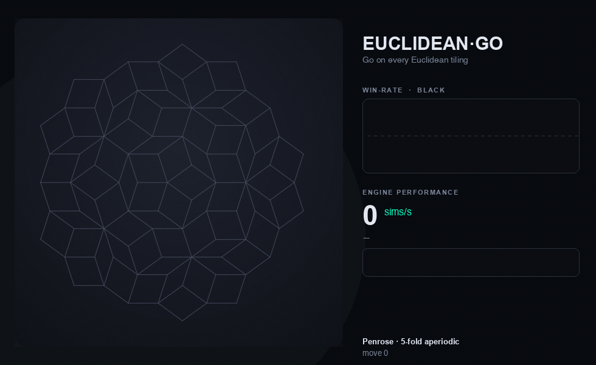

# Euclidean Go

[](https://github.com/vonduffen/euclidean-go/actions/workflows/ci.yml)
[](LICENSE)

**A geometry-blind Go engine that plays on *any* Euclidean tiling — square, hexagonal,
triangular, the Archimedean tilings, even an aperiodic Penrose rhombus tiling — with a single
neural network.**

## ▶️ [**Play it now in your browser →**](https://vonduffen.github.io/euclidean-go/)

No install, no sign-up. Works on desktop and mobile, runs entirely client-side (offline after
the first load), with the trained neural engine as your opponent on every tiling. *(It's a
~4.5 MB page, so give it a moment on the first load.)*

[](https://vonduffen.github.io/euclidean-go/)

Go is really a *graph game*: stones live on the intersections of a board, connect along lines,
and are captured when a group runs out of liberties. Nothing in the rules cares whether those
intersections form a square grid. Euclidean Go takes that idea literally — the rules engine, the
Monte-Carlo Tree Search, and the neural network **never see geometry**. They operate on a
`BoardGraph` (nodes + edges). Geometry exists only in two places: the *tiling compiler* that
turns a tiling into a graph, and the *renderer* that draws it.

One consequence is unusual: the same trained network plays every board in the catalogue,
including tilings it was never trained on. The network is **geometry-blind by construction**, so
"transfer to a new tiling" is just inference on a different graph.

## What's in the box

- **A rules engine for graph Go** — captures, suicide prohibition, positional superko
  (Tromp–Taylor, Zobrist hashing), area scoring — that runs on any `BoardGraph`.
- **A tiling compiler** for all **11 Euclidean uniform (regular + Archimedean) tilings**, plus
  rectangular boards of any size and an aperiodic **Penrose** tiling.
- **A geometry-blind graph neural network** (policy + value), with Laplacian-eigenvector
  positional encodings so the net can tell vertices apart without coordinates.
- **A PUCT MCTS** search (AlphaZero-style) in both Python and a fast C++ implementation.
- **A trained "universal champion"** network, included (`results/universal/champion.pt`),
  trained by self-play on a mixture of substrates.
- **Three ways to play** (below).

## Quickstart

Requires Python ≥ 3.11. Using [uv](https://docs.astral.sh/uv/) (recommended):

```bash
uv sync                       # installs numpy + torch
uv run python scripts/play.py # opens http://127.0.0.1:8770 in your browser
```

or with plain pip:

```bash
pip install -e .
python scripts/play.py
```

Pick a tiling from the dropdown and click an intersection to place a stone. The neural engine
plays the other colour; there's an analysis overlay (candidate moves + a win-rate graph) and an
undo button.

### Three front-ends

| | How | Notes |
|---|---|---|
| **Python server** | `uv run python scripts/play.py` | Full analysis (territory/ownership). Needs Python + torch. |
| **Portable webapp** | open `webapp/tilinggo.html` in any browser | **WebAssembly engine** (the C++ engine compiled with SIMD128, ~10× the old JS engine: ≈265 vs ≈25 sims/s on a 9×9) with automatic pure-JS fallback. Fully offline, no install. |
| **Native macOS app** | `python scripts/build_native.py` → `dist/native/` | C++/Accelerate engine — multi-threaded + AMX, ≈870 sims/s on a 9×9 (~3–4× the in-browser WASM). Apple-Silicon, optional. |

The pure-JS engine in `webapp/` is verified to match the PyTorch network's outputs
(`node scripts/webapp_check.cjs`).

### Sharing games

**🔗 Copy game link** puts the whole game in the URL — board, every move, nothing else needed.
Send it to anyone: opening the link replays the game to the exact position, with full undo
history, and they can keep playing from there (the engine waits for *their* move). The format is
plain text in the fragment (`#g=1.penrose_medium.<fingerprint>.<moves>`), so links work on any
static host, survive mobile share sheets, and a 100-move game fits in ~330 characters. A
fingerprint of the board graph guards against links made for a different build of the site.
Serialization is property-tested (`node scripts/share_check.cjs`: 200 random games × 5
substrates round-trip to identical positions and superko histories).

## How strong is it? (an honest answer)

The included network is trained purely by self-play (no human games, no external engines). We
gauge it by **head-to-head match play against internal baselines**, reported with 95% Wilson
confidence intervals — not by an official rank.

- On the **square** board it plays at a **kyu (club) level**. We do not claim a precise rank: the
  only external calibration we have is on square, and absolute strength on the exotic tilings is
  **not externally gauged** — there is no "9×9 Penrose dan rating" to compare against.
- Training on a **mixture** of substrates produces one network that is **measurably stronger on
  every non-square tiling** than a square-only specialist, **with no loss on square**, and the
  gains **generalize to tilings held out of training** (e.g. an Archimedean tiling and a larger
  Penrose region). These are head-to-head win-rate measurements, not absolute ratings.

We try hard not to overclaim. If you find positions where it plays badly, that's expected and
interesting — please open an issue.

## Why "any tiling" is the point

Most Go engines are square-grid-specific in their bones (fixed-size convolutions, 19×19 input
planes). Because Euclidean Go is graph-native, the *same weights* evaluate a hexagonal board, a
snub-square tiling, or an aperiodic Penrose patch. The board is data, not architecture. That makes
it a small testbed for a real question: **does a model learn substrate-invariant concepts, or does
it memorize a grid?**

For the full picture — tiling compiler → BoardGraph → geometry-blind GNN → MCTS, with a
diagram and links to the evidence for every claim — see
**[docs/how-it-works.md](docs/how-it-works.md)**.

## Architecture

```
tilinggo/
  rules/      graph Go: BoardGraph, GoState, captures, superko, scoring
  tilings/    compilers: periodic (square/tri/hex), uniform (11 Archimedean), penrose
  nn/         geometry-blind GNN (model) + feature encoding (Laplacian PE)
  search/     PUCT MCTS + evaluators (neural and a net-free heuristic)
  ui/         SVG renderer + the play server
  export.py   board/weight export to the C++ engine
cpp/          the same engine in C++ (Accelerate) + a tiny HTTP play server
webapp/       a pure-JS port of the engine for the offline browser app
scripts/      play + the two front-end builders
tests/        rules (classical + property + differential), tilings, nn, render
```

The neural network sees, per node: the game state, the node's degree (one-hot), distance to the
board boundary, a Laplacian positional encoding, and a few globals. No coordinates. Masking and
batching across mixed tilings/sizes are covered by the test suite.

## Tests

```bash
uv sync --extra dev   # installs pytest (or: pip install -e ".[dev]")
uv run pytest         # rules (incl. a differential test vs an independent reference), tilings, nn
```

## License

Apache-2.0 — see [LICENSE](LICENSE). The bundled weights were produced entirely by self-play
within this project (see [NOTICE](NOTICE)).

## Citation

If you use Euclidean Go in academic work, please cite it (a `CITATION.cff` will follow). For now:

```
@software{euclidean_go,
  title  = {Euclidean Go: a geometry-blind Go engine for arbitrary Euclidean tilings},
  author = {Dufour-Richard, Alexandre},
  year   = {2026},
  url    = {https://github.com/vonduffen/euclidean-go}
}
```
