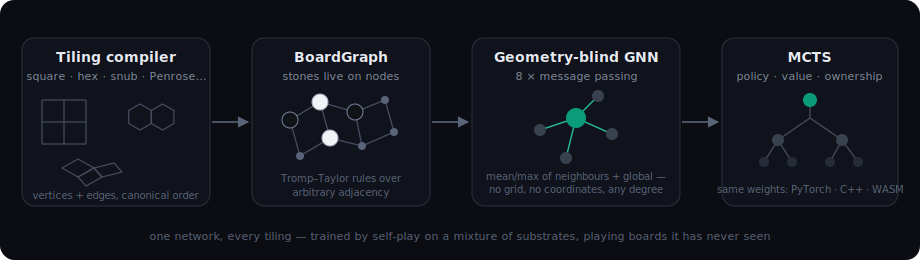

# How Koala works

*One neural network that plays Go on a square board, a hexagonal board, a Penrose tiling, and
boards it has never seen — with the same weights. This page explains how, for a curious
dan-level player or ML hobbyist. No equations required.*

## The board is just a graph

Go doesn't actually need a grid. The rules — liberties, capture, ko, territory — only talk
about *which points touch which*. So the engine never sees coordinates: a board is a
**graph** — points (nodes) and adjacencies (edges) — and stones sit on the nodes.

The **tiling compiler** ([`tilinggo/tilings/`](../tilinggo/tilings/)) turns a tiling
description into that graph: it lays out a patch of the tiling (square, hexagonal, triangular,
the Archimedean families, 2-uniform mixes, or an aperiodic Penrose patch), takes its vertices
and edges, and emits a `BoardGraph` in a deterministic node order (pinned by
[`tests/test_node_ordering.py`](../tests/test_node_ordering.py) — shareable games depend on
it). The rules engine ([`tilinggo/rules/`](../tilinggo/rules/gostate.py)) is a faithful
Tromp–Taylor implementation (area scoring, positional superko) over arbitrary graphs, with a
classical reference implementation cross-checking it in
[`tests/test_rules_differential.py`](../tests/test_rules_differential.py).

On a square patch this reproduces ordinary Go exactly. On a Penrose patch you get points with
four neighbours next to points with seven — and the *same rules* produce recognizably Go-like
play with alien tactics.

## A network that can't see geometry

Most Go engines (AlphaZero, KataGo) use convolutional networks: their very first layer assumes
a fixed grid. Change the board and the architecture breaks.

This engine's network ([`tilinggo/nn/model.py`](../tilinggo/nn/model.py)) is a **graph neural
network** that is *geometry-blind by construction*. Each node carries 42 features
([`tilinggo/nn/encoding.py`](../tilinggo/nn/encoding.py)):

- **game features** — own/opponent stone, liberty counts of the chain, legality, recent moves;
- **structure features** (precomputed per board) — degree one-hot, distance to the boundary,
  and Laplacian positional encodings (a spectral "shape signature" of the graph);
- **global scalars** — move number, komi, points on the board.

Eight rounds of *message passing* follow: every node updates itself from the **mean and max of
its neighbours** plus a whole-board summary. Mean and max don't care how many neighbours there
are or where they sit — which is exactly why the same weights run on any graph. Three heads
read the result out: a **policy** (where to play), a **value** (who's winning), and an
**ownership** map (whose territory each point becomes).

## Search and training

The network alone is a fast intuition. Play comes from **Monte-Carlo tree search** guided by
it (PUCT, as in AlphaZero — [`tilinggo/search/`](../tilinggo/search/), and the same algorithm
ported to C++ ([`cpp/mcts.hpp`](../cpp/mcts.hpp)) and to the browser). Training is pure
self-play from random weights: play games with search, train the net to predict the search's
conclusions and the game outcomes, repeat — across a **mixture of substrates** in one replay
buffer, so the network is forced to learn rules-level concepts (liberties, eyes, connection)
rather than any one board's geometry. No human games, no external engines.

## Does one net really transfer?

The claim that matters: the network plays boards it never trained on. Evidence in this repo:

- The **same weights** ship in three runtimes — PyTorch, C++, WebAssembly — verified to agree
  to ~10⁻⁶ ([`scripts/webapp_check.cjs`](../scripts/webapp_check.cjs),
  [`scripts/wasm_check.cjs`](../scripts/wasm_check.cjs)); so what you play in the browser *is*
  the trained net.
- The mixture-trained champion beats a square-only specialist on every non-square substrate,
  **including held-out tilings absent from training** (rect7, trihexagonal, large Penrose
  patches) — summarized honestly, with its limits, in the README's
  ["How strong is it?"](../README.md#how-strong-is-it-an-honest-answer) section.
- Where it's weak, we say so: a dan-level review placed its life-and-death around 8–10k, and
  the committed [L&D suite](../tests/lnd/) quantifies it — the shipped champion finds the
  vital point of a three-space eyespace **0/18 times**
  ([`scripts/lnd_score.py`](../scripts/lnd_score.py)). Strength varies by board; on unusual
  substrates *you* are the one with transferable intuition.

That asymmetry is the fun of it: on a Penrose board, both of you are visitors, but you brought
better luggage.

## Try it

**[Play in your browser →](https://vonduffen.github.io/koala/)** — or read the
[game-record format](game-record-format.md), build the
[native macOS app](../README.md#quickstart), or train your own net from the
[README](../README.md).
